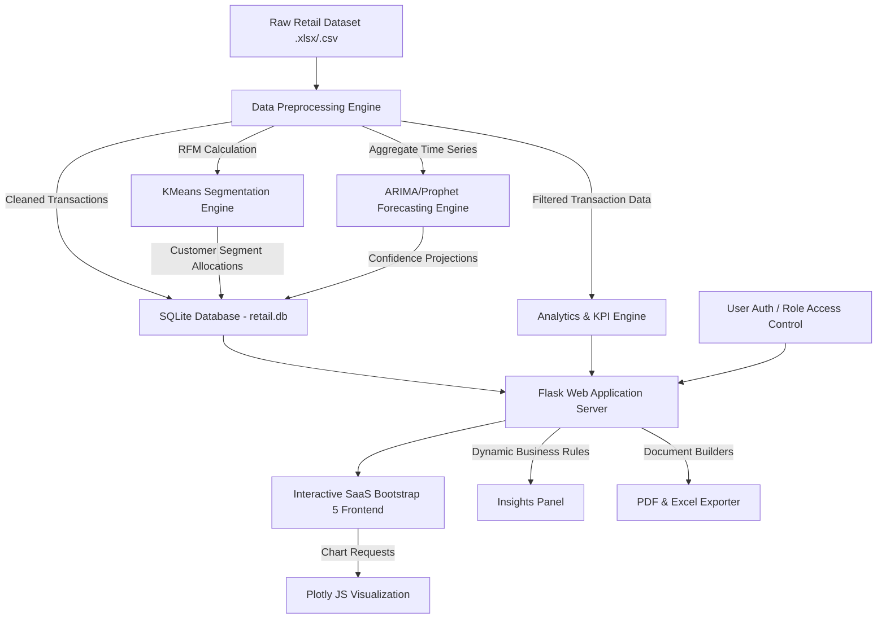

# RetailIQ
### AI-Powered Retail Intelligence, Customer Segmentation & Demand Forecasting Platform

RetailIQ is a production-ready, end-to-end Data Science and Full-Stack web application designed for retail managers, analysts, and administrators. It ingests historical transaction logs (leveraging the UCI Online Retail dataset of 540,000+ rows), preprocesses the transactions, applies KMeans clustering for RFM customer segmentation, generates daily/weekly/monthly revenue demand forecasts using ARIMA, auto-generates business insights, and outputs professional PDF and Excel reports.

---

## 1. System Architecture



---

## 2. SQLite Database Schema

The database `database/retail.db` contains 6 core tables:
1. `users`: Stores user credentials and hashed passwords.
   - `id` (INTEGER, PK), `username` (TEXT, Unique), `password_hash` (TEXT), `role` (TEXT: Admin, Manager, Analyst), `created_at` (TIMESTAMP).
2. `uploaded_datasets`: Logs transaction file uploads and statistics.
   - `id` (INTEGER, PK), `filename` (TEXT), `filepath` (TEXT), `row_count` (INTEGER), `upload_date` (TIMESTAMP), `status` (TEXT: Processed, Pending, Failed).
3. `customer_segments`: Contains RFM scores, assigned segments, and Customer Lifetime Value (CLV) aggregates.
   - `id` (INTEGER, PK), `customer_id` (TEXT, Unique), `recency` (INTEGER), `frequency` (INTEGER), `monetary` (REAL), `clv` (REAL), `avg_basket` (REAL), `segment` (TEXT), `updated_at` (TIMESTAMP).
4. `forecast_results`: Holds future revenue predictions and confidence intervals.
   - `id` (INTEGER, PK), `forecast_date` (TEXT), `forecasted_value` (REAL), `confidence_lower` (REAL), `confidence_upper` (REAL), `model_name` (TEXT), `period_type` (TEXT: Daily, Weekly, Monthly).
5. `generated_reports`: Tracks compiled exports.
   - `id` (INTEGER, PK), `report_name` (TEXT), `report_type` (TEXT: PDF, Excel, CSV), `file_path` (TEXT), `created_by` (TEXT), `created_at` (TIMESTAMP).
6. `business_insights`: Stores auto-generated textual recommendations.
   - `id` (INTEGER, PK), `title` (TEXT), `description` (TEXT), `category` (TEXT), `importance` (TEXT: High, Medium, Low), `created_at` (TIMESTAMP).

---

## 3. Installation Steps

### Prerequisites
- Python 3.11.x
- C++ Build Tools (only if compiling Prophet from source, otherwise falls back gracefully to Holt-Winters)

### Steps
1. **Clone/Move into the workspace directory:**
   ```bash
   cd AI-Retail-Intelligence-Platform
   ```

2. **Create a Virtual Environment:**
   ```bash
   python -m venv .venv
   ```

3. **Activate the Virtual Environment:**
   - **Windows PowerShell:**
     ```powershell
     .venv\Scripts\Activate.ps1
     ```
   - **macOS / Linux:**
     ```bash
     source .venv/bin/activate
     ```

4. **Install Dependencies:**
   ```bash
   pip install -r requirements.txt
   ```

---

## 4. Run Commands

To launch the development server:
```bash
python app.py
```
By default, the server spins up at: `http://127.0.0.1:5000/`

### Default User Credentials
- **Admin**: `admin` (pwd: `admin123`)
- **Manager**: `manager` (pwd: `manager123`)
- **Analyst**: `analyst` (pwd: `analyst123`)

---

## 5. Testing Guide

A pipeline verification script is provided under `tests/verify_pipeline.py`. It runs unit tests and mock endpoint evaluations to verify database state, preprocessing logic, KMeans cluster sizing, ARIMA predictions, and report builders.

To execute tests:
```bash
python -m unittest tests/verify_pipeline.py
```

---

## 6. Deployment Guide

### A. Dockerizing (Local or Production)
Build and run the container locally:
```bash
# Build Docker image
docker build -t retailiq:latest .

# Run Docker container
docker run -p 5000:5000 -e SECRET_KEY="prod-secret-key" retailiq:latest
```

### B. Railway Deployment
1. Log in to [Railway.app](https://railway.app/).
2. Create a **New Project** and select **Deploy from GitHub repo**.
3. Choose the `AI-Retail-Intelligence-Platform` repository.
4. Set the Environment Variables:
   - `SECRET_KEY`: `your-custom-production-key`
   - `PORT`: `5000`
5. Railway will read the `Dockerfile` automatically and build/run the server.

### C. Render Deployment
1. Log in to [Render.com](https://render.com/).
2. Click **New** -> **Web Service**.
3. Connect your GitHub repository.
4. Configure service values:
   - **Environment**: `Docker`
   - **Instance Type**: `Free` (or higher)
   - **Region**: Choose closest to target audience
5. Add Environment Variables in the "Environment" tab:
   - `SECRET_KEY` = `your-custom-production-key`
   - `PORT` = `5000`
6. Click **Deploy Web Service**.
